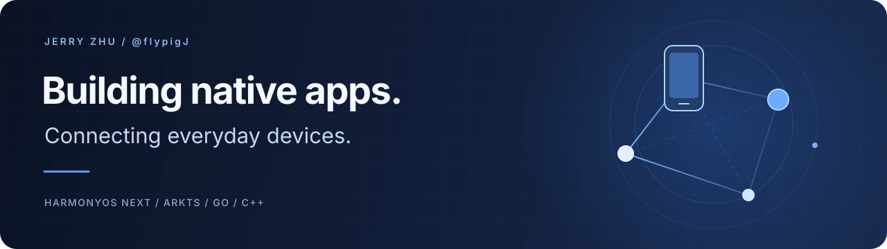
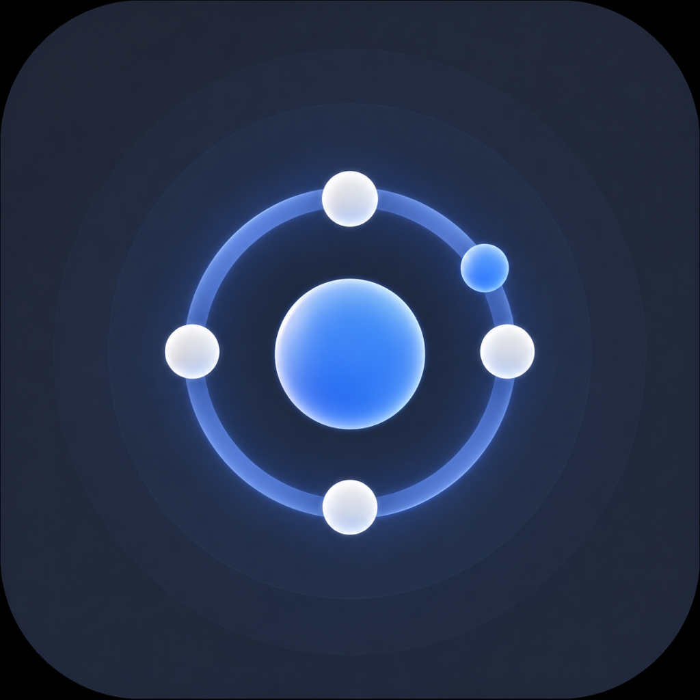

  

# Hi, I'm Jerry / 你好，我是 Jerry

Student developer building for **HarmonyOS NEXT**. I work on native interfaces and tools that help everyday devices work together.

学生开发者，正在探索鸿蒙原生应用与跨设备连接。希望把复杂的技术，做成日常用得上的工具。

**[Explore MeshArc](https://github.com/flypigJ/Tailscale-OHOS)** · **[Get the app](https://appgallery.huawei.com/app/detail?id=io.github.tailscaleohos)** · **[中文项目介绍](https://github.com/flypigJ/Tailscale-OHOS#readme)**

## Building · 正在做

### [MeshArc](https://github.com/flypigJ/Tailscale-OHOS)

A native Tailscale community client for HarmonyOS NEXT. Connect to your devices, transfer files, browse Taildrive shares and reach your media servers from a familiar interface.

让鸿蒙设备加入你的 Tailscale 网络：连接电脑与 NAS、互传文件、浏览远程共享，并联动媒体播放器。

`ArkTS` · `ArkUI` · `Go` · `C++` · `HarmonyOS NEXT`

[Project & documentation](https://github.com/flypigJ/Tailscale-OHOS/blob/main/README.en.md) · [华为应用市场](https://appgallery.huawei.com/app/detail?id=io.github.tailscaleohos) · [Issues & feedback](https://github.com/flypigJ/Tailscale-OHOS/issues)

## Exploring · 关注方向

| Focus | What interests me |
| --- | --- |
| **Native experiences / 原生体验** | Adaptive layouts, clear interactions and thoughtful details on HarmonyOS. |
| **Connected devices / 设备互联** | Private networking, file transfer and access to self-hosted services. |
| **From UI to systems / 从界面到系统** | Bringing ArkTS, C++ and Go together in a working application. |

## Build with me · 一起改进

Tried MeshArc on your device? Reproducible bug reports, translation improvements and device-compatibility feedback all help. Start with the [contributing guide](https://github.com/flypigJ/Tailscale-OHOS/blob/main/CONTRIBUTING.md) or share a focused suggestion in [Issues](https://github.com/flypigJ/Tailscale-OHOS/issues).

欢迎通过项目 Issue 交流使用体验、提出建议，也欢迎一起完善文档、翻译与设备兼容性。
